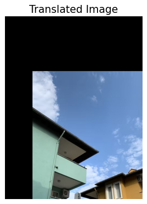
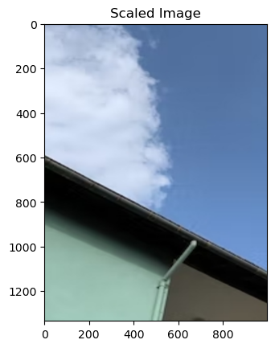
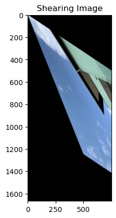
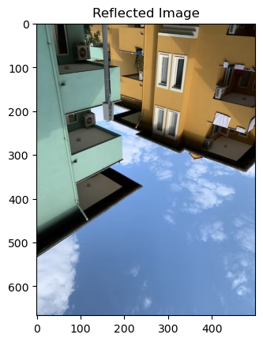
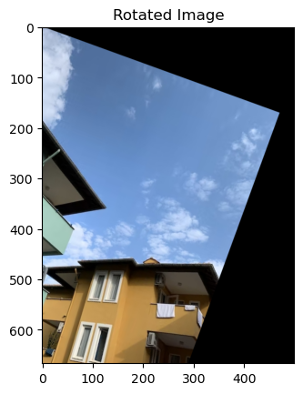
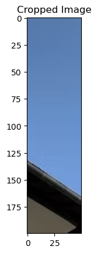

#EX-05-Image-Transformation
## Aim
To perform image transformation such as Translation, Scaling, Shearing, Reflection, Rotation and Cropping using OpenCV and Python.

## Software Required:
Anaconda - Python 3.7

## Algorithm:
### Step1:

Import the necessary libraries and read the original image and save it a image variable.

### Step2:

Create a transformation matrix and apply a perspective transformation to the image amd display the resulting image.

### Step3:

Similarly Create a perspective matrix for scaling the image and using the appropriate function display the scaled image

### Step4:

Specify the angle of rotation in radians for displaying rotated image and display it.

### Step5:

End the execution.

## Program:
```python
Developed By: Kersoan P
Register Number: 212221230050

i)Image Translation

# Disable x & y axis
plt.axis('off')
plt.title("Translated Image",fontsize= 15)
# show the resulting image
plt.imshow(translated_image)
plt.show()

ii) Image Scaling

rows,cols,dim = input_image.shape
M = np.float32([[5.8,0,0],
               [0,4.5,0],
                [0,0,1]])
scaled_img = cv2.warpPerspective(input_image,M,(cols*2,rows*2))
plt.title("Scaled Image")
plt.imshow(scaled_img)
plt.show()


iii)Image shearing

M = np.float32([[1,1.5,0],
               [2.5,1,0],
               [0,0,1]])
shearing_img = cv2.warpPerspective(input_image,M,(int(cols*1.5),int(rows*2.5)))
plt.title("Shearing Image")
plt.imshow(shearing_img)
plt.show()


iv)Image Reflection

M = np.float32([[1,0,0],[0,-1,rows],[0,0,1]])
M_y = np.float32([[1,0,cols],[0,-1,rows],[0,0,1]])
ref_img = cv2.warpPerspective(input_image,M,(int(cols),int(rows)))
refy_img = cv2.warpPerspective(input_image,M_y,(int(cols),int(rows)))
plt.imshow(ref_img)
plt.title("Reflected Image")
cv2.imshow('reflected_y',refy_img)
cv2.waitKey(0)
cv2.destroyAllWindows()


v)Image Rotation

angle = np.radians(20)
M = np.float32([[np.cos(angle),-(np.sin(angle)),0],
               [np.sin(angle), np.cos(angle), 0],
               [0,0,1]])

rotated_img = cv2.warpPerspective(input_image,M,(int(cols),int(rows)))

plt.title("Rotated Image")
plt.imshow(rotated_img)
plt.show


vi)Image Cropping

cropped_img = input_image[100:300,150:200]
plt.title("Cropped Image")
plt.imshow(cropped_img)
plt.show


```
## Output:
### i)Image Translation



### ii) Image Scaling



### iii)Image shearing



### iv)Image Reflection



### v)Image Rotation




### vi)Image Cropping




## Result: 

Thus the different image transformations such as Translation, Scaling, Shearing, Reflection, Rotation and Cropping are done using OpenCV and python programming.
